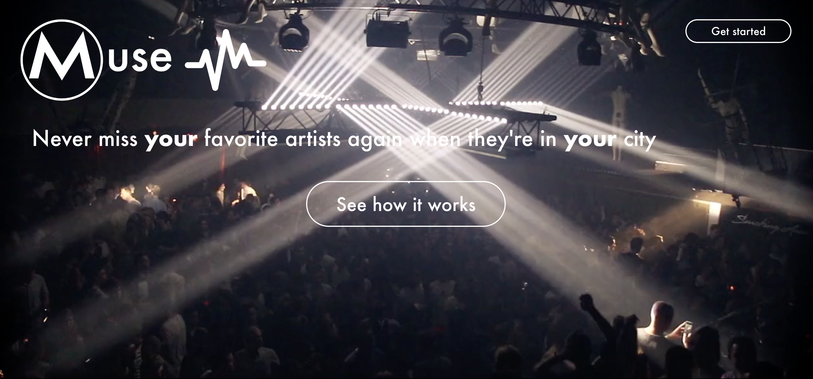
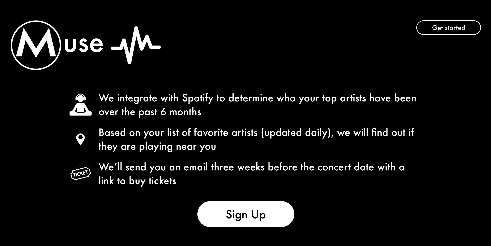

# Muse

Muse is a dynamic concert discovery platform that notifies music-lovers about relevant concerts in real-time. I was initially inspired with the idea, when there where a series of concerts I did not know about and missed (and would have loved to attend). After speaking with friends, I realized that others also had this same pain point, either that people find out about concerts too early (months in advance) or too late (few days before or after the event). Muse's role is to programmatically notify users of concerts they'd love to attend within an actionable time frame, three weeks before the concerts take place. Spotify does something similar, but a few friends and I either don't get these emails and / or are unable to customize these emails.

  
  

# How It Works

1. Sign up on the website with your email and desired location

2. Authorize Muse to access your Spotify. Muse uses your listening history from the past 6 months to determine your top artists. We update these artists daily using an automatic task scheduler, [node-cron](https://www.npmjs.com/package/node-cron)!

3. After pulling artist data, Muse will send an API call to Ticketmaster to determine if there are any upcoming concerts within three weeks for your favorite artists

4. If so, we send an email to you with a link to quickly buy tickets!

Currently, I am integrating Ticketmaster API in step 3.
